# Latent Manifolds of the 2D Ising Model

This repository studies how modern representation learning methods organize the configuration space of the two-dimensional Ising model around its phase transition.

---

## Phase Transition and Dataset Overview

Configurations are generated on a 32×32 lattice using the Wolff cluster Monte Carlo algorithm, with dense temperature sampling near the critical region. Each configuration is labeled with its temperature, phase (ordered vs disordered), magnetization per spin, and energy per spin.

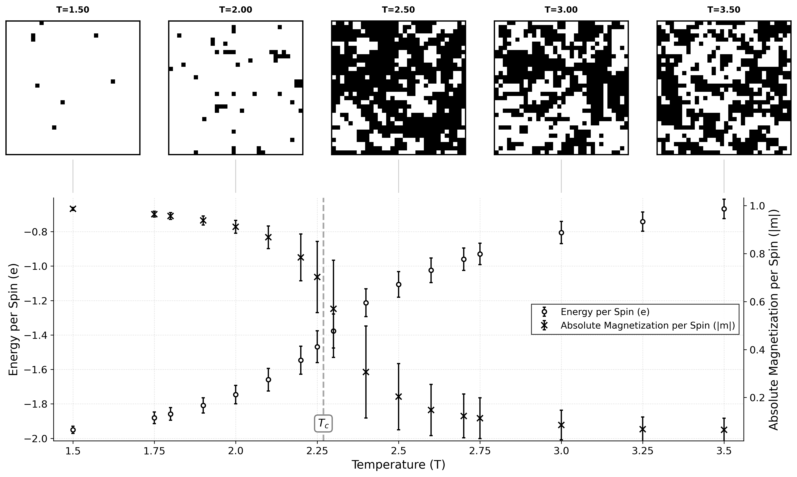

---

## Principal Component Analysis (PCA)

PCA is applied directly to the standardized 1024-dimensional spin configurations. The first principal component explains the majority of variance in the dataset and aligns strongly with the physical order parameter (magnetization), demonstrating that the phase transition dominates the dataset’s intrinsic geometry.

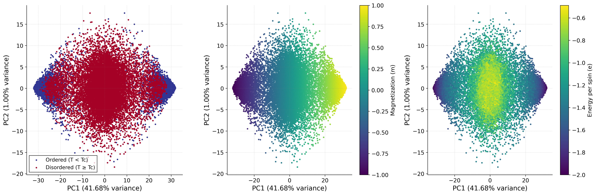

The near-linear relationship between PC1 and magnetization confirms that PCA captures the order parameter directly from raw data.

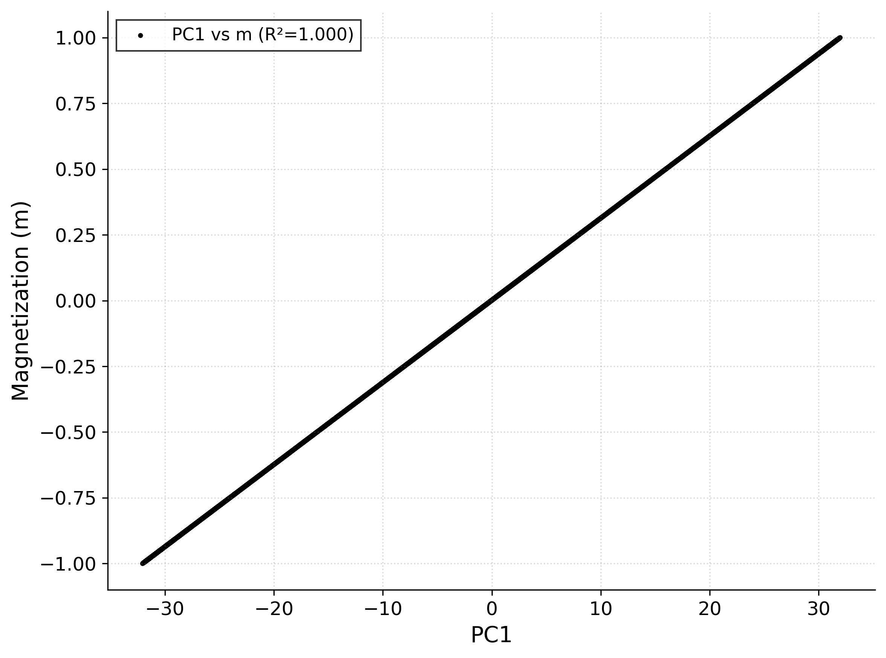

Exploring the first three principal components in 3D further reveals the manifold structure of the data, with distinct regions corresponding to ordered and disordered regimes.

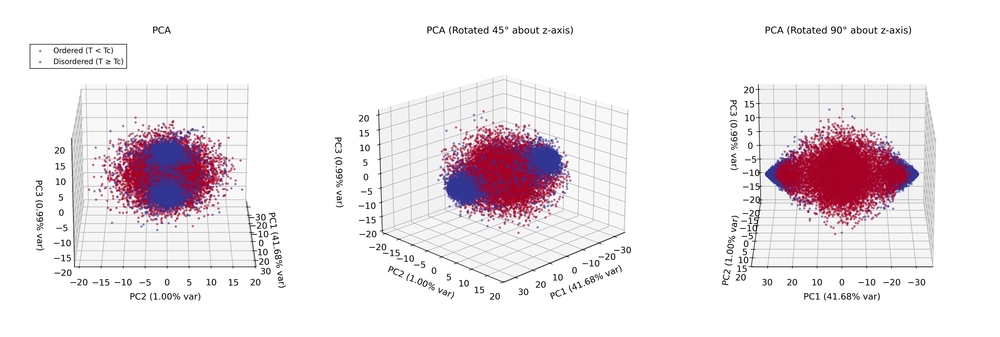

---

## Variational Autoencoder (VAE) Representation

A convolutional VAE is trained with latent dimensionalities \(z=1\) and \(z=4\). Without supervision from physical labels, the VAE’s latent variables nonetheless organize around meaningful physical variation.

For \(z=4\), each latent dimension is evaluated for its correlation with magnetization:

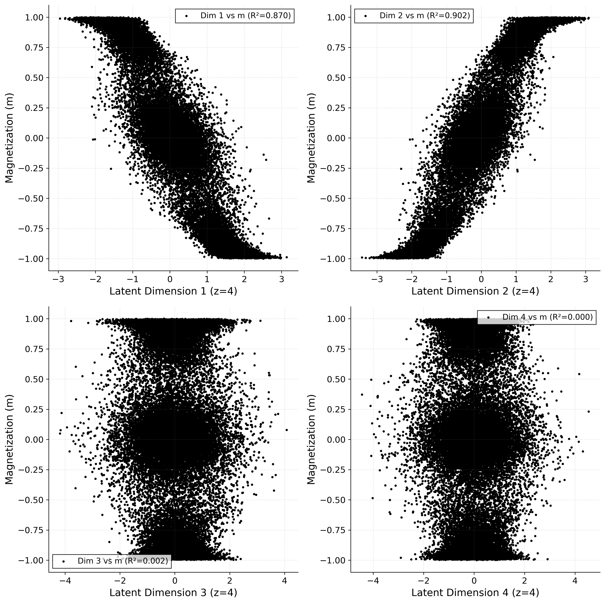

Pairwise latent projections show how different latent directions capture complementary structure. Some projections distinguish ordered versus disordered manifolds; others encode continuous variation related to energy or finer microstate texture.


Applying PCA to the VAE latent embeddings imposes an ordered variance hierarchy. The leading PCA direction of the latent space again aligns with magnetization, confirming that the VAE captures the dominant physical coordinate in an unsupervised manner.

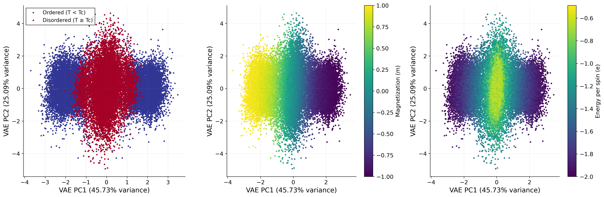

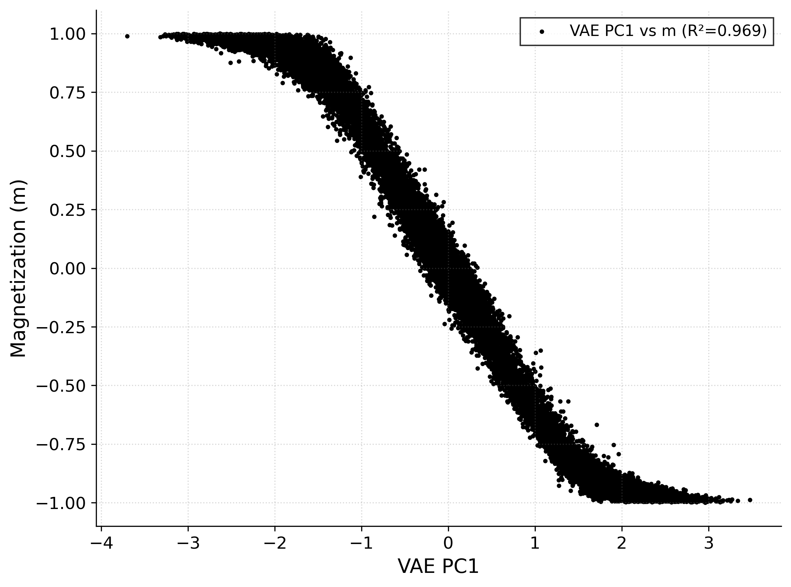

Visualizing the first 3 learned latent dimensions in 3D provides an intuitive view of how the nonlinear VAE representation forms a structured manifold incorporating both phase separation and continuous variation:

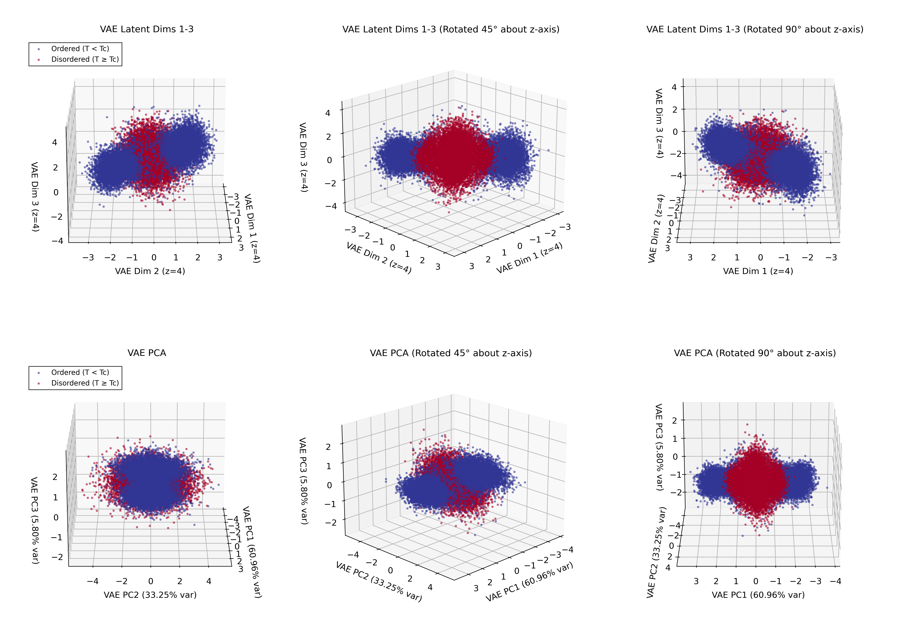

---

## Convolutional Neural Network (CNN) Embeddings

A CNN classifier is trained to predict phase labels (ordered vs disordered). Although supervision is limited to phase labels, the learned internal representations nonetheless encode rich physical information.

Grad-CAM is used to interpret where the network attends during classification. Near the critical temperature, the model focuses on spin clusters and domain boundaries, consistent with physical intuition about critical fluctuations.

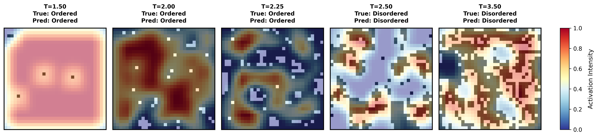

PCA applied to CNN embeddings reveals a low-dimensional structure that captures the phase transition. Embedding directions correlate with magnetization and energy even though these variables were not used during training.

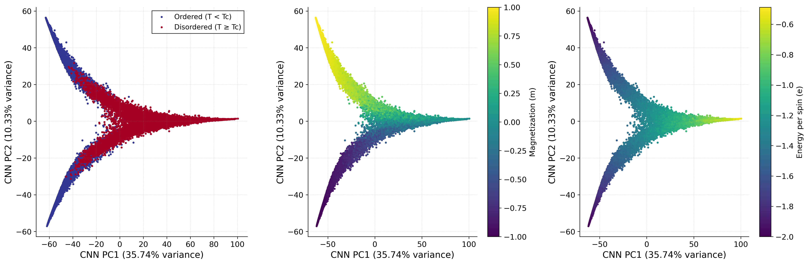

3D PCA views of the learned embeddings further illustrate the separation of ordered and disordered manifolds.

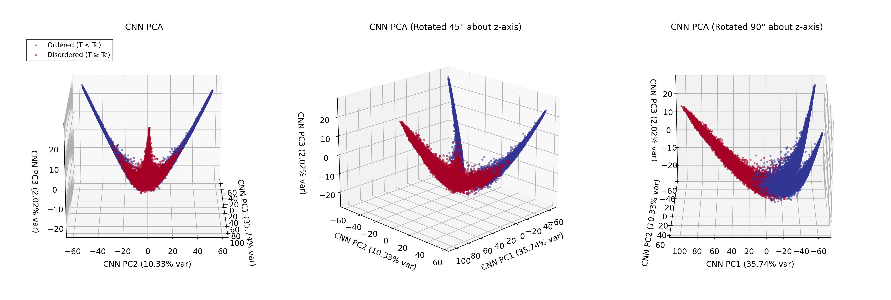

---

## Reproducibility

All steps from data generation to analysis and visualization are scripted. Running the provided shell scripts reproduces the figures shown here. Figures are saved under `results/figures/` and model checkpoints under `results/checkpoints/`.

---

## Setup

```bash
python3 -m venv venv
source venv/bin/activate
pip install -U pip
pip install -r requirements.txt